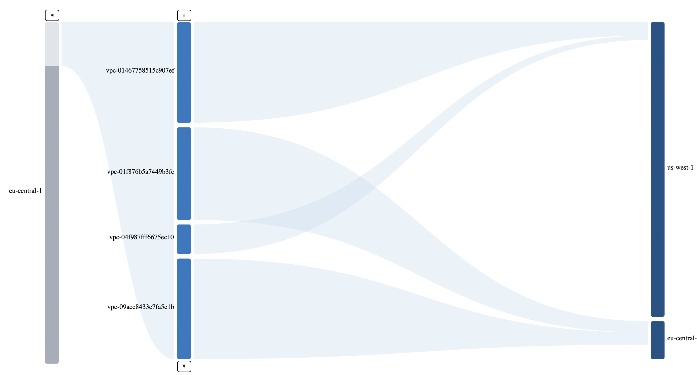

# CloudFlow Sankey

The CloudFlow Sankey is a custom column constrained Sankey visualization primarily for use in visualizing the "flows" from different networking abstractions. e.g. all flows from AWS region -> region, region -> VPC, region to VPC, and any combination thereof.

## See it in action

- Clone the repository
- `npm ci` (to install dependencies)
- `npm run dev` (to start the dev server)
- Open the url shown in the terminal in the browser

## To consume as a library

- `npm run build` (creates `/dist`)
- Manually copy `te-sankey.js` and `style.css` over
- (Note this is temporary until the library is stablized)
